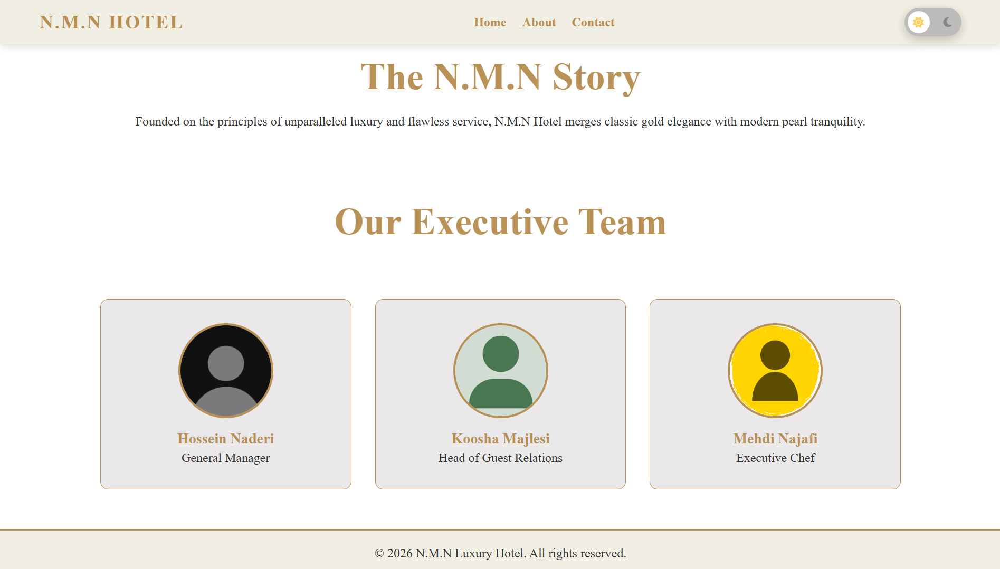
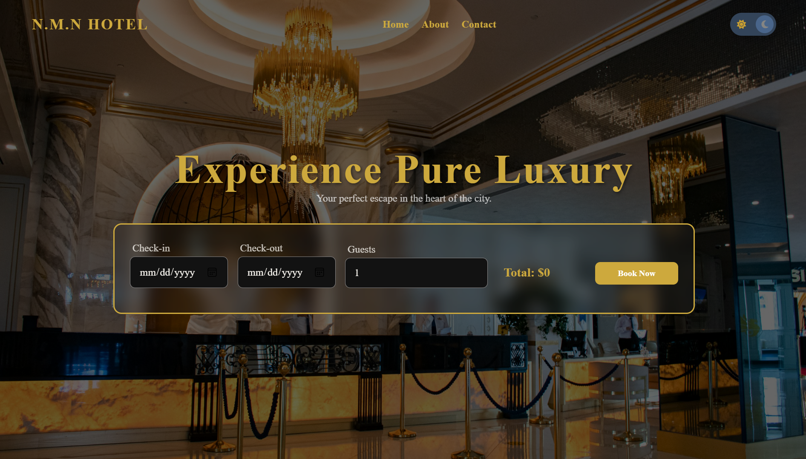
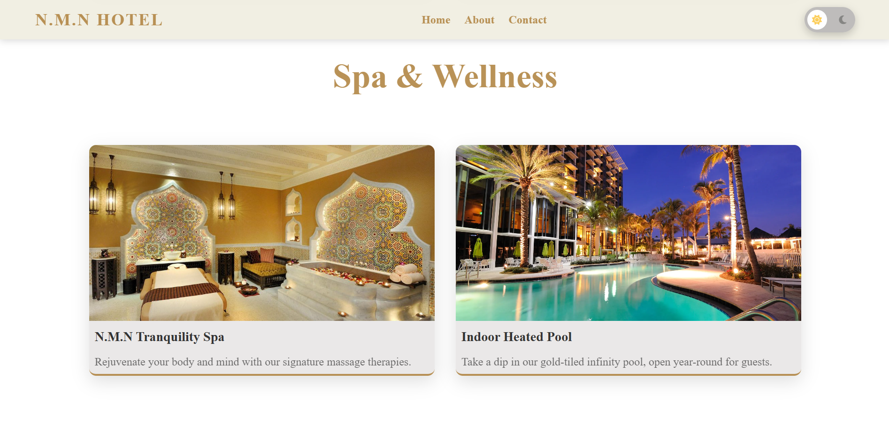
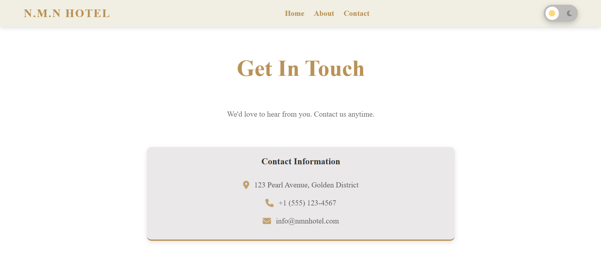
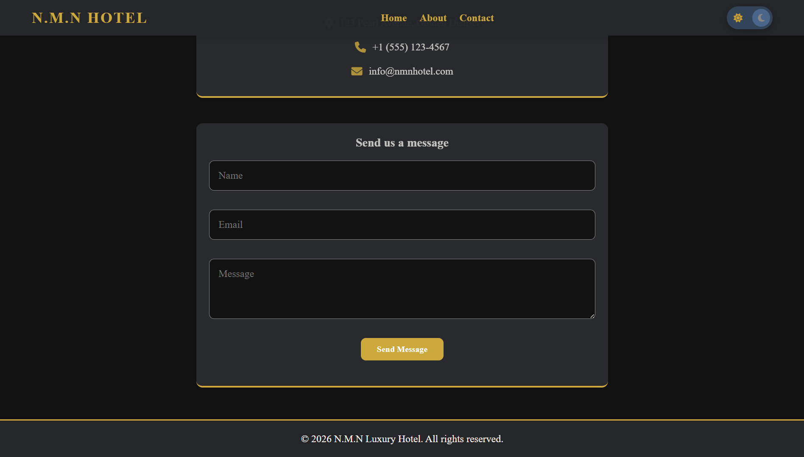

# Hotel Management System

A web-based **Hotel Management System (HMS)** designed to simplify and automate hotel operations for guests, staff, and administrators.

The system provides an integrated platform for managing room reservations, payments, invoices, room statuses, hotel services, staff operations, and customer feedback.

This project demonstrates a practical multi-entity relational database system with structured workflows, role-based access control, and centralized data management.

---

## Project Objective

The objective of this project is to design and implement a smart and organized hotel management platform that improves operational efficiency, reduces manual errors, and supports better decision-making through centralized information management.

---

# Core Features

- Guest account and reservation management
- Room browsing and filtering by:
  - Room type
  - Capacity
  - Date range
  - Price
- Reservation registration and confirmation
- Online and offline payment tracking
- Automatic invoice generation
- Additional service request management
- Room status management
- Staff information and role management
- Customer feedback and rating system
- Administrative reports and analytics

---

# User Roles

## Admin / Manager

Full system access:

- Hotel information management
- Room and room type management
- Reservation monitoring
- Payment and invoice management
- Staff management
- Service management
- Customer feedback analysis
- Reports and analytics

---

## Staff

Access based on assigned roles:

- Reception:
  - Reservation and guest management

- Cashier:
  - Payment and invoice processing

- Cleaning Supervisor:
  - Room status updates

- Service Staff:
  - Service request handling

---

## Customer / Guest

Customers can:

- Browse available rooms
- Filter rooms
- Make reservations
- Complete payments
- View invoices
- Request additional services
- Submit feedback

---

# Main Entities

The system is built around the following entities:

- Hotel
- Customer
- Room
- Room Type
- Reservation
- Payment
- Invoice
- Service
- Staff
- Feedback

---

# Entity Relationships

- One hotel has many rooms
- One hotel has many staff members
- One customer can have many reservations
- One reservation belongs to one customer
- One reservation belongs to one room
- One reservation can have multiple payments
- One reservation generates one invoice
- One staff member can provide multiple services
- One reservation can have associated feedback

---

# Workflow Overview

1. Guest logs into the system
2. Guest searches available rooms
3. Reservation is created
4. Payment process is completed
5. Reservation status changes to confirmed
6. Invoice is generated
7. Additional services can be requested
8. Staff manage operational tasks
9. Checkout and final settlement are completed
10. Guest submits feedback

---

# Sample Reports

The system can generate reports such as:

- Active and upcoming reservations
- Current resident guests
- Occupied and available rooms
- Revenue reports
- Employee role lists
- Service request reports
- Customer feedback analysis
- Unsettled invoices
- Complete guest stay history

---

# Database Design Scope

This project demonstrates:

- One-to-Many relationships
- Many-to-Many relationships through intermediate tables
- Logical and physical database design
- Data normalization
- Reduction of data redundancy
- Data consistency improvement
- Reporting and analytics support

---

# Technology Stack

## Frontend
- HTML
- CSS
- JavaScript

## Backend
- Python
- Flask

## Database
- MySQL

---

# Project Structure

```
hotel-management-system/
│
├── hotel-backend/     # Flask backend application
│
├── frontend/          # Frontend source code
│
├── database/          # Database scripts and schema
│
├── document/          # Project documentation
│
├── screenshots/       # Application screenshots
│
└── README.md
```

---

# Screenshots

## About Page



## Booking Page



## Gallery Page



## Contact Page (Light Mode)



## Contact Page (Dark Mode)



---

# Installation

## Backend Setup

Navigate to backend folder:

```bash
cd hotel-backend
```

Create virtual environment:

```bash
python -m venv env
```

Install dependencies:

```bash
pip install -r requirements.txt
```

Run Flask server:

```bash
python app.py
```

---

## Database Setup

Import the SQL files from:

```
database/
```

Configure database connection settings in the backend configuration file.

---

# Future Improvements

- Online payment gateway integration
- Email notifications
- Mobile application
- Advanced analytics dashboard
- Cloud deployment

---

# Contributors

Developed as a full-stack hotel management system project.
